# Assignment 5: Bombs!

The terrain is now filled with bombs!

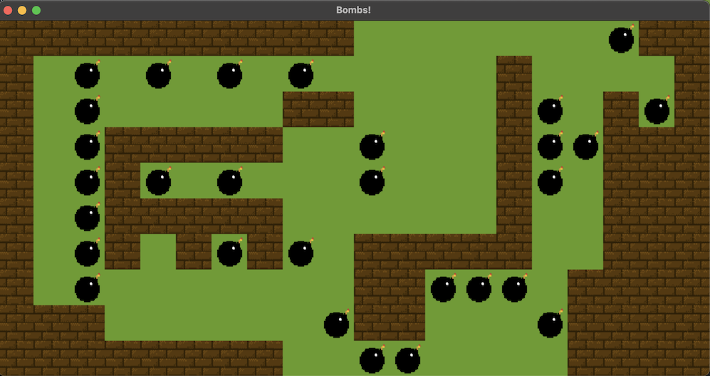

## Bombs

When a bomb detonates it's blast shoots out in the up, down, left, and
right directions. The bomb's "radius" is the number of steps from the
center of the blast. It is set to a constant of 3 in the starter, but
can be changed.

### Basic bomb detonation

|                          |               |                             |
|--------------------------|---------------|-----------------------------|
| 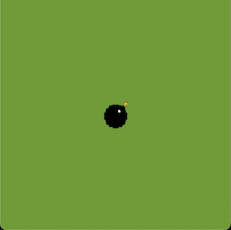 | $\rightarrow$ | 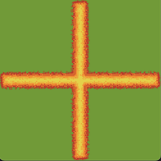 |

### Bombs should detonate immediately if struck the blast of another bomb

|                          |               |                             |
|--------------------------|---------------|-----------------------------|
| 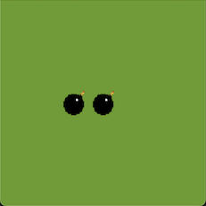 | $\rightarrow$ | 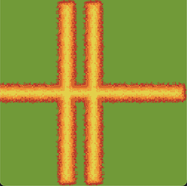 |

### Bombs should detonate immediately if struck the blast of another bomb

|                          |               |                             |
|--------------------------|---------------|-----------------------------|
| 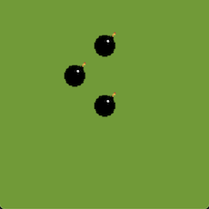 | $\rightarrow$ | 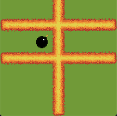 |

## Walls

A wall is an entity that can be destroyed by a bomb blast:

|                          |               |                             |
|--------------------------|---------------|-----------------------------|
| 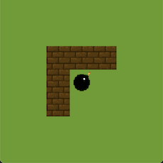 | $\rightarrow$ | 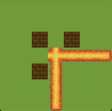 |

Notice that the blast stops once it hits the wall and does not extend
past:

|                          |               |                             |
|--------------------------|---------------|-----------------------------|
| 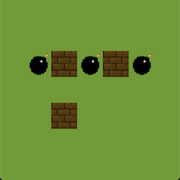 | $\rightarrow$ | 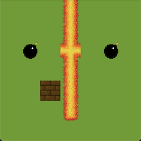 |

This is true no matter how many bombs explode at the same time: chained
bombs explode at the same moment:

|                          |               |                             |
|--------------------------|---------------|-----------------------------|
| 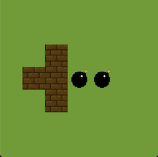 | $\rightarrow$ | 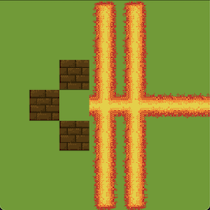 |

# Representing flames

When bomb detonation crosses a terrain cell, the *path* of the
detonation will combine with paths from other detonations. For example,
if a cell has a horizontal flame `─` and a detonation crosses it with a
vertical flame `|` then the combined flame is `┼`.

There are 16 possible flame tokens, based on the explosion paths that
have crossed the cell.

| Down  | Up    | Right | Left  | Token |                            |
|-------|-------|-------|-------|-------|----------------------------|
| False | False | False | False | ` `   |  |
| False | False | False | True  | `╴`   | 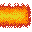 |
| False | False | True  | False | `╶`   |  |
| False | False | True  | True  | `─`   | 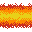 |
| False | True  | False | False | `╵`   | 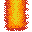 |
| False | True  | False | True  | `┘`   | 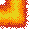 |
| False | True  | True  | False | `└`   | 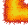 |
| False | True  | True  | True  | `┴`   |  |
| True  | False | False | False | `╷`   | 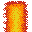 |
| True  | False | False | True  | `┐`   | 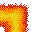 |
| True  | False | True  | False | `┌`   | 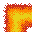 |
| True  | False | True  | True  | `┬`   | 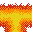 |
| True  | True  | False | False | `│`   | 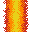 |
| True  | True  | False | True  | `┤`   |  |
| True  | True  | True  | False | `├`   | 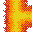 |
| True  | True  | True  | True  | `┼`   |  |

The graphical terrain uses different sprites to display the terrains.

The dictionary `flame_tokens` stores the tokens by a *binary*
representation of the directions. Hint: how can you use the bit-wise
"or" operator (`|`) in your code?

## Example

Note when these bombs detonate, the sprites where they join are
connected:

|                          |               |                             |
|--------------------------|---------------|-----------------------------|
|  | $\rightarrow$ | 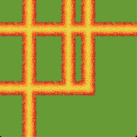 |

# Requirements

Implement a function:

``` python
def detonate(pos: Position, terrain: Terrain) -> dict[Position, Token]:
```

the will detonate the bomb at `pos` and return a dictionary of the
positions whose tokens will be updated. For example, the detonation
`(6, 4)`:

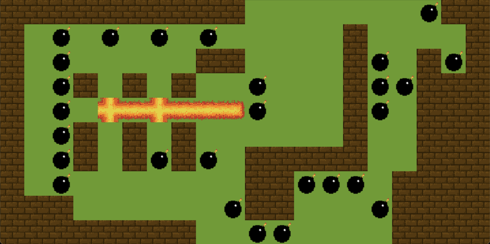

will return

``` python
{
    (4, 5): Token.EMPTY,
    (3, 4): Token.EMPTY,
    (6, 5): Token.EMPTY,
    (4, 3): Token.EMPTY,
    (6, 3): Token.EMPTY,
    (6, 4): Token("┼"),
    (7, 4): Token("─"),
    (8, 4): Token("─"),
    (9, 4): Token("╴"),
    (5, 4): Token("─"),
    (4, 4): Token("┼")
}
```

The `detonate` function must be implemented *recursively*, using a
recursive helper function. You can decide which parameters are necessary
for your function.

Additional requirements:

1.  Do not modify the `terrain` in your functions. Your function should
    return the dictionary containing the updated tokens.

2.  Do not use global variables, instead pass extra parameters in your
    recursive function.

# Graphics

The graphical version of the terrain is clickable:

|               |                         |
|---------------|-------------------------|
| **click**     | detonate a bomb.        |
| **w + click** | add a wall at position. |
| **b + click** | add a bomb at position. |

Have fun!
